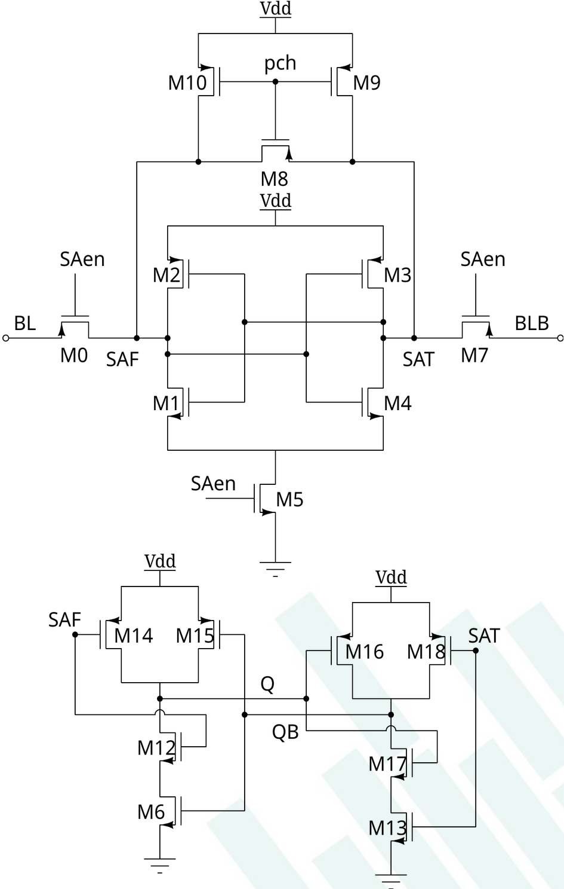
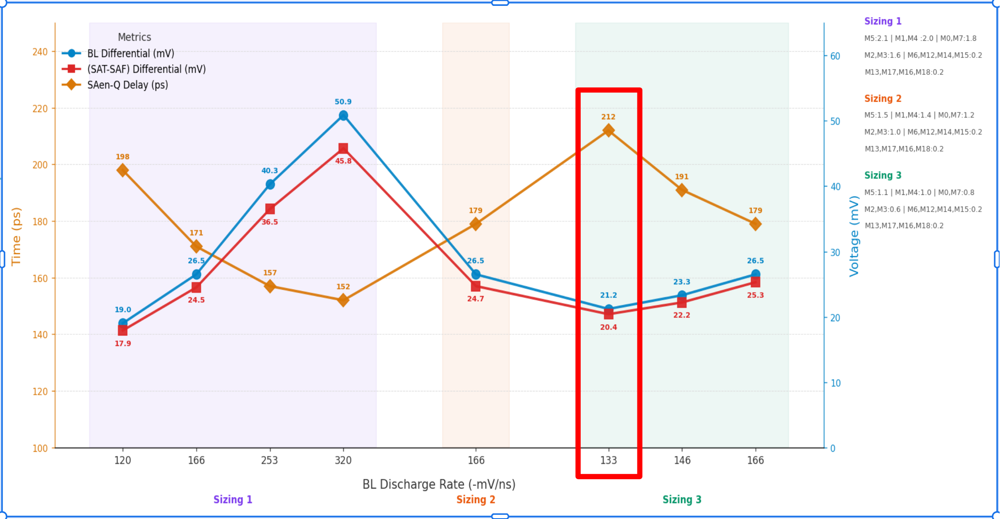
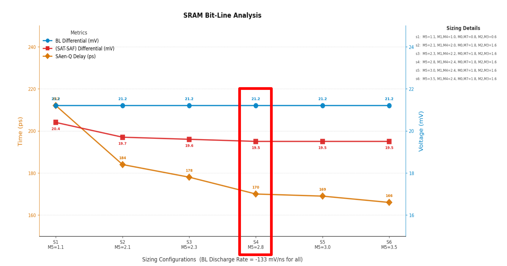
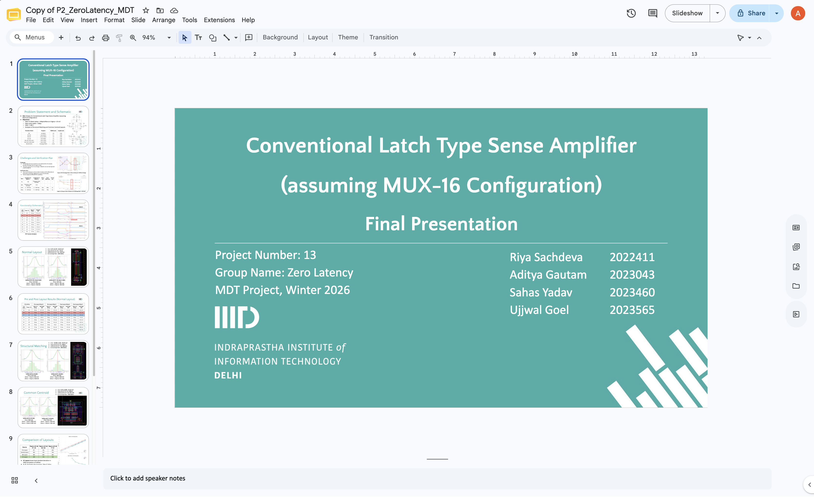

# Conventional Latch Type Sense Amplifier

## Objective

Design of a conventional latch type sense amplifier assuming a MUX16 configuration for the load

Need to design and analyze the structural matched and common centroid layouts as well along with the
base layout

## Specifications

| Specification      | Value    |
|--------------------|----------|
| $T_{SAen-Q}$       | $200 ps$ |
| $V_{offset} @ 3σ$  | $25 mV$  |
| $SAen Pulse Width$ | $100 ps$ |
| $V_{DD}$           | $1.08 V$ |

## Verification Plan

Input stimuli given to measure SAen-Q delay and Bitline differential at which Sense Amplifier Enable
Signal (SAen) should be triggered for correct Sense somethin Amplifier operation.

| Input | Amplitude for READ 1 (V)   | Amplitude for READ 0 (V)   | Delay (ps) | Pulse Width (ps) | Period (ps) |
|-------|----------------------------|----------------------------|------------|------------------|-------------|
| BL    | 1.08 V                     | Piecewise Linear Discharge | -          | -                | -           |
| BLB   | Piecewise Linear Discharge | 1.08 V                     | -          | -                | -           |
| PCH   | Pulse: 0 - 1.08 V          | Pulse: 0 - 1.08 V          | 50 ps      | 250 ps           | 2 ns        |
| SAen  | Pulse: 0 - 1.08 V          | Pulse: 0 - 1.08 V          | 150 ps     | 100 ps           | 2 ns        |

## Sizing

- We firstly found the SAen-Q delay and BL differential voltage by tweaking the BL discharge rate for
  different sizings
- From the values, we picked and fixed the BL discharge rate for which we get the lowest Bitline
  differential voltage

- Now with the fixed differential voltage, we vary the sizing and pick the one which offers the best
  tradeoff between delay and transistor sizes
 

### Final Sizing

| Transistor Name    | Purpose        | Width (um) | Length (um) |
|--------------------|----------------|------------|-------------|
| M5                 | Tail NMOS      | 2.8        | 0.06        |
| M1, M4             | Latch NMOS     | 2.4        | 0.06        |
| M0, M7             | Access PMOS    | 1.8        | 0.06        |
| M2, M3             | Latch PMOS     | 1.6        | 0.06        |
| M6, M12, M14, M15  | Latch 1 MOS    | 0.2        | 0.06        |
| M13, M17, M16, M18 | Latch 2 MOS    | 0.2        | 0.06        |
| M8, M9, M10        | Precharge PMOS | 0.135      | 0.06        |

## Presentation

